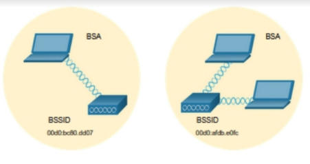

# WLAN

## _Introduction_

### Tipe Wireless Network

- WPAN
- WLAN
- WMAN
- WWAN

### Wireless Technology

- Bluetooth: 100m
- WiMax: 50km
- Cellular broadband
  - GSM
  - CDMA
- Satellite

### 802

- 2.4GHz (UHF) only:
  - 802.11
  - 802.11b
  - 802.11g
- 5 GHz (SHF) only:
  - 802.11.a
  - 802.11ac
- Both:
  - 802.11n
  - 802.11ax
  
### Standard Organization

- ITU
- IEEE
- Wi-Fi Alliance

---

## _WLAN_

### WLAN Component

- Wireless NIC e.g. dongle
- Wireless Home Router  
  Serve as:
  - AP, providing wires access
  - Switch, interconnecting wired devices
  - Router, providing a default gateway to other network
- Wireless AP

### AP Categories

- Autonomous:  
  Standalone, configured through a CLI or GUI.
- Controller-based/Lightweight AP:  
  Use Lightweight Access Point Protocol (LWAPP). Automatically controlled & managed by a WLAN Controller (WLC).

### Wireless Antenna

- Omnidirectional
- Directional
- MIMO

---

## _WLAN Operation_

### Wireless Topology Modes

- Adhoc: Client peer-to-peer
  
  

- Infrastructure: Connect client to the network through AP  
  

- Tethering: Sharing network/cellular access as a personal hotspot  
  

### Topology blocks

- Basic Service Set (BSS):  
  Single AP interconnecting all wireless clients. Client in different BSS can't communicate.  
  
- Extended Service Set (ESS):  
  Union of >=2 BSSs, interconnected by a wired system. Clent in a different BSS can communicate through ESS.  
  

### 802.11 Frame

- Header
  - Frame Control
  - Duration
  - Address 1
  - Address 2
  - Address 3
  - Sequence Control
  - Address 4
- Payload
- FCS

### Carrier-Sense Multiple Access with Collision Avoidance (CSMA/CA)

WLAN are half-duplex and can't "hear" while sending. WLAN can't detect collision. CSMA/CA tries to avoid collision.

- Client listen if channel is idle.
- Client send Ready to Send (RTS) to AP to request dedicated channel.
- AP send Clear to Send (CTS).
- Client wait a random time if not CTS is received, then restarting the process.
- Client transmits data.
- Acknowledgement.

### Wireless AP Association

- Processs:
  - Discovery
  - Authentication
  - Association
- Parameter:
  - SSID
  - Password
  - Network mode e.g. 802.11
  - Security mode e.g. WEP, WPA, WPA2
  - Channel settings: frequency band

### WAP Discovery mode

- Passive mode:  
  AP openly advertise its service, periodically sending broadcast beacon frames that contains:
  - SSID
  - Supported standards
  - Security settings

---

## _CAPWAP_

### Introduction

- Standard protocol that enable WLC to manage APs & WLANs.
- Based on LWAPP but add security with Datagram Transport Layer Security (DTLS)
- Port: UDP/5246, UDP/5247, IP/17, IPv6/136

### Split MAC Architecture

  

### FlexConnect

APs are controlled by a WLC through a WAN Link/different network with CAPWAP.

- Connected mode: WLC is reachable, WLC performs all CAPWAP function.
- Standalone mode: WLC is unreachable, the AP can assume some of the WLC function e.g. switching client data traffic and client authentication.

---

## _Channel Management_

### Modulation

- Direct-Sequence Spread Spectrum (DSSS): spreading signal over wide frequency band to avoid interference
- Frequency-Hopping Spread Spectrum (FHSS): rapidly switching carrier frequency.
- OFDM: single channel use multiple sub-channel.

### 2.4Ghz Channel Selection

- Range: 2.2 Ghz ~ 2.5 GHz (14 channel)
- Channel Bandwidth: 22 MHz (, exception on channel 13 only has 12 MHz)
- Channel separation: 5 MHz
- Best practice: non-overlapping e.g. 1-6-11

### 5Ghz Channel Selection

- 24 Channel
- Channel separation: 20 MHz
- Best practice: non-overlapping e.g. 36, 48, 60

---

## _WLAN Threat_

- DOS
  - Cause:
    - Improper configuration
    - Malicious user interference
    - Accidental interference
  - Mitigation:
    - Device hardening
    - Keep password secure
    - Create backups
    - Ensure all configuration changes are incorporated off-hours.
- Rogue AP  
  - Connected to a corporate network without explicit authorization.  
  - Rogue AP can be used to capture MAC address, data packet, gain access, launch man-in-the-middle attack, etc.  
  - Prevention:
    - Configure WLC with rogue AP policies
    - Use monitoring software that actively monitor radio spectrum.
- Man-in-the-middle
  - Hacker is positioned between two legitimate entities.
  - Hacker attempts to read or modify data.
  - Hacker can use a Rogue AP with same SSID as a legitimate AP.
  - Mitigation:
    - Identifying legitimate devices.
    - Identifying illegitimate devices.
    - Network/device monitoring.

---

## _Secure WLAN_

### Security Feature

- SSID Cloacking: Disable SSID Beacons. Client must confugre SSID manually.
- MAC Address filtering: Manually permit device.

### Auth Methods

- Open system: No password
- Shared key

### Shared Key Auth Methods

- WEP: Rivest Cipher 4 (RC4), static key, deprecated
- WPA: WEP+Temporal Key Integrity Protocol (TKIP), key is changed for each packet, Wi-Fi Alliance standard
- WPA2: AES, current strongest encryption protocol
- WPA3: next-generation, use Protected Managament Frames (PMf).

### WPA2 Auth Methods

- Personal: For home/small office network. Use pre-shared key (PSK). No special auth server is required.
- Enterprise: For enterprise network. Use Remote Authentication Dial-In User Service (RADIUS) server and Extensible Authentication Protocol (EAP).

### Encryption Protocol

- TKIP: Used WPA & legacy WLAN. Encrypt WEP's Layer 2.
- AES: Used by WPA2.

### Enterprise authentication

Requirements:

- RADIUS server's IP address
- Port:
  - UDP/1812 (auth), UDP/1813 (accounting)
  - UDP/1645 (auth), UDP/1646 (accounting)
- Shared key: to authenticate AP with RADIUS server
